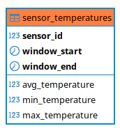

# SENSOR DATA PIPELINE

## 📖Introduction 
This project focuses on simulating sensor data and processing it through a data pipeline using Kafka, and Spark. It serves as a learning exercise to understand the integration and functionalities of these technologies.


## 🌍Overview 
Sensors generate temperature data every second and send it to a Kafka topic. Every 15 minutes, the collected data is processed to compute the minimum, maximum, and average temperatures, which are then stored in a PostgreSQL database for future batch processing.  

In addition to temperature data, the system also manages sensor logs, identifying events such as disconnections or extreme temperature values.  

### Components
- `producer.py`: simulates sensor data and publishes it to Kafka.  
- `sensor_consumer.py`: consumes sensor data from Kafka topic named `sensor-data`, processes temperature readings every 15 minutes, and stores the aggregated results (min, max, average) in PostgreSQL.  
- `log_consumer.py`: consumes log data from Kafka topic named `log-data`, detecting anomalies such as sensor disconnections or extreme temperature values for further analysis.  

**Application Architecture**

diagrama

### Data Storage and Use

The application database, `sensor_data`, is composed of only one table:

- `sensor_temperatures`: table that stores the processed sensor data consumed from the `sensor-data` topic every 15 minutes.  



## ⚙️Installation and Configuration

### 1. Clone the repository

```sh
git clone https://github.com/Jesus-Guijarro/sensor-data-pipeline.git
```

### 2. Create Virtual Environment and Install Dependencies
```sh
python3 -m venv sensor-venv
```

### Activate the virtual environment
```sh
source sensor-venv/bin/activate
```
### Upgrade pip (optional but recommended)
```sh
pip install --upgrade pip
```
### Install the libraries from `requirements.txt`
```sh
pip install -r requirements.txt
```

### 3. Install and configure Kafka and Spark

#### Download **Kafka**
```sh
wget https://downloads.apache.org/kafka/3.7.0/kafka_2.13-3.7.0.tgz
```

#### Extract and mov to /opt
```sh
tar -xzf kafka_2.13-3.7.0.tgz && mv kafka_2.13-3.7.0 kafka && sudo mv kafka /opt && rm kafka_2.13-3.7.0.tgz
```

#### Environment Variables

```sh
nano ~/.bashrc
```

Add at the end:

```sh
#Kafka
export KAFKA_HOME=/opt/kafka
export PATH=$PATH:$KAFKA_HOME/bin
```

Then run:
```sh
source ~/.bashrc
```

#### Download **Spark**
```sh
wget https://dlcdn.apache.org/spark/spark-3.5.1/spark-3.5.1-bin-hadoop3.tgz
```

#### Extract and move spark to /opt
```sh
tar -xzf spark-3.5.1-bin-hadoop3.tgz && mv spark-3.5.1-bin-hadoop3 spark && sudo mv spark /opt && rm spark-3.5.1-bin-hadoop3.tgz
```

#### SPARK_HOME Variable
```sh
nano ~/.bashrc
```
Add at the end:
```sh
#Spark
export SPARK_HOME=/opt/spark
export PATH=$PATH:$SPARK_HOME/bin:$SPARK_HOME/sbin
```
Then run:
```sh
source ~/.bashrc
```
## Test Spark
```sh
spark-shell
```

## Download .jar to connect Spark -> SQL
```sh
wget https://repo1.maven.org/maven2/org/apache/spark/spark-sql-kafka-0-10_2.12/3.0.0/spark-sql-kafka-0-10_2.12-3.0.0.jar
```

### 4. Setup Database 

### PostgreSQL
Access PostgreSQL:
```sh
psql
```

Create the database:
```sql
CREATE DATABASE sensor_data;
```

Connect to the database:
```
\c sensor_data
```

#### Create the tables:
```sql
CREATE TABLE sensor_temperatures (
    sensor_id INT,
    window_start TIMESTAMP,
    window_end TIMESTAMP,
    avg_temperature DECIMAL(5,2),
    min_temperature DECIMAL(5,2),
    max_temperature DECIMAL(5,2),
    PRIMARY KEY (sensor_id, window_start, window_end)  -- Cambia el índice único a estas columnas
);
```

### 5. Config database file

1. Create the config database file:
```sh
touch config.ini
```

2. Configure your database connection details in `config.ini`:
```conf
[database]
dbname = sensor_data
user = postgres
password =  ***
host = localhost
port = 5432
```

### 6. Final Project Structure

```
📦 sensor-data-pipeline
├── 📂 database
│ ├── 🐍 database.py
│ └── 🛢️ sensor_data_db.sql
├── 📂 resources
│ ├── 📄 spark-sql-kafka-0-10_2.12-3.0.0.jar
│ └── 📄 start_kafka.sh
├── 📂 sensor-venv
├── 🚫 .gitignore
├── ⚙️ config.ini
├── 📜 LICENSE
├── 🐍 log_consumer.py
├── 🐍 producer.py
├── 📄 README.md
├── 📄 requirements.txt
├── 🐍 sensor_consumer.py
└── 🐍 sensor.py
```

## 🚀Running the Project

### Kafka
Each command in a separate terminal:
```sh
zookeeper-server-start.sh /opt/kafka/config/zookeeper.properties
```
```sh
kafka-server-start.sh /opt/kafka/config/server.properties
```

Create the `sensor-data` topic:

```sh
kafka-topics.sh --create --topic sensor-data --bootstrap-server localhost:9092 --partitions 1 --replication-factor 1
```

Create the `log-data` topic:

```sh
kafka-topics.sh --create --topic log-data --bootstrap-server localhost:9092 --partitions 1 --replication-factor 1
```

## Sensor
Run `producer.py` from the terminal with the virtual environment `sensor-env` activated:
```sh
python producer.py
```

Verify that Kafka is receiving data from the sensors:
```sh
kafka-console-consumer.sh --bootstrap-server localhost:9092 --topic sensor-data --from-beginning
```
```sh
kafka-console-consumer.sh --bootstrap-server localhost:9092 --topic log-data --from-beginning
```

Use Spark Streaming to analyze data in `sensor-data` and send the result to the PostgreSQL database `sensor_data`, table `sensor_averages`:

```sh
spark-submit --packages org.apache.spark:spark-sql-kafka-0-10_2.12:3.0.0 --jars resources/spark-sql-kafka-0-10_2.12-3.0.0.jar sensor_consumer.py
```

In other terminal:
```sh
python log_consumer.py
```

If you want to delete the data stored in the `sensor-data` and `log-data` topics:
```sh
kafka-topics.sh --bootstrap-server localhost:9092 --delete --topic sensor-data

kafka-topics.sh --bootstrap-server localhost:9092 --delete --topic log-data
```

### Run script to start Kafka, Zookeper and to create the Kafka topic `sensor-data`

```sh
cd resources
```

Execution permissions
```sh
chmod +x start_kafka.sh
```
### Run script:
```sh
./start_kafka.sh
```

## 🔍Extra

- `spark-sql-kafka-0-10_2.12-3.0.0.jar`: Spark-Kafka Connector that enables Spark Structured Streaming to read from and write to Apache Kafka topics.
- `start_kafka.sh`: script to run the Zookeper and Kafka servers, once they are running the Kafka `sensor-data` topic is created.

## 🛠Technologies Used

- **Programming Language**: Python
- **Data Streaming**: Apache Kafka
- **Data Processing**: Apache Spark
- **Database**: PostgreSQL

## 🔜Future improvements

- Visualize real-time log data with tools such as Grafana.
- Process sensor data stored in the database every day and generate a daily report.