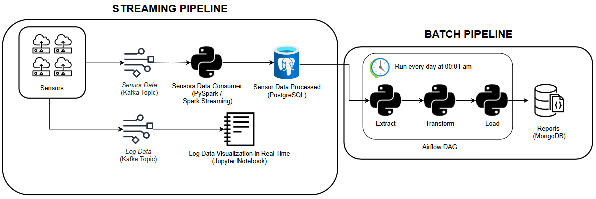
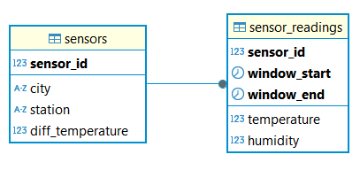

# SENSOR DATA PIPELINE

## 📖Introduction 
This project simulates sensor data and processes it through two pipelines: a streaming pipeline using Apache Kafka and Apache Spark for real-time processing, and a batch pipeline using Apache Airflow for scheduled processing. The goal is to demonstrate the integration of these technologies in a cohesive data pipeline.

## ⚡ Streaming Pipeline
In the streaming pipeline, virtual sensors generate temperature and humidity readings every second and publish them to Kafka topics. A Spark Structured Streaming job consumes this data in near real-time (e.g. in short micro-batches) and stores the sensor readings into a PostgreSQL database. The system also handles sensor event logs (such as disconnections or measurement anomalies) via a separate Kafka topic (`log-data`) for monitoring purposes. All incoming sensor data is saved in the sensor_data PostgreSQL database, which contains a time-series table for readings and a data table for sensor info. Architecture: The streaming pipeline architecture is illustrated below, showing how sensor data flows from Kafka through Spark into PostgreSQL.

### Components
- `streaming/sensor.py` – Defines the `Sensor` class used by the producer. It simulates realistic sensor behavior, generating normal readings and injecting occasional anomalies (e.g. a disconnection or a faulty measurement).
- `streaming/producer.py` – Simulates multiple sensors and continuously publishes their temperature/humidity data to Kafka topics (`sensor-data` for sensor readings, and `log-data` for any warning/error logs).
- `streaming/sensor_consumer.py` – Spark Structured Streaming application that consumes messages from the `sensor-data` Kafka topic. It performs real-time processing (e.g. basic filtering or windowing) and writes the sensor readings into the PostgreSQL database. Each record in the database includes sensor ID, timestamp, temperature, and humidity.


## 📦 Batch Pipeline
The batch pipeline is orchestrated by Apache Airflow to run on a daily schedule. It performs an **Extract-Transform-Load (ETL)** process on the accumulated sensor data. Each day, the pipeline extracts the previous day's sensor readings from the PostgreSQL database, transforms them into summary **reports** (calculating daily minimum, maximum, and average values for temperature and humidity, as well as hourly averages), and loads these aggregated results into a MongoDB database for long-term storage and analysis. This pipeline typically runs at off-peak hours (e.g. nightly) and provides historical insights that complement the real-time monitoring.

### Components
- `batch/extract.py` – Extracts sensor readings from the PostgreSQL database for a given date range (e.g. a 24-hour period). It connects to the `sensor_data` database and queries the `sensor_readings` table (joining with the `sensors` table to get location info) to retrieve all relevant records, returning them as a pandas DataFrame.
- `batch/transform.py` – Transforms the raw data into a structured report format. It groups the DataFrame by sensor and date to compute summary statistics: daily min/max/avg for temperature and humidity, and also calculates the average readings per hour. It outputs a list of dictionaries (one per sensor per day) containing these metrics and an hourly breakdown.
- `batch/load.py` – Loads the transformed reports into MongoDB. It connects to the MongoDB instance (default `localhost:27017`) and upserts each report into the `sensor_data_batch` database's `reports` collection. Each report document is uniquely identified by a combination of sensor_id and date.
- `airflow/dags/sensor_data_pipeline_dag.py` (Airflow DAG) – Defines the workflow for the batch pipeline in Airflow. This DAG schedules the daily ETL job and orchestrates the execution of extract, transform, and load tasks (using the above modules). It ensures the tasks run in order and handles any scheduling logic (such as catching up missed intervals or setting execution dates).

**Architecture:** The project architecture is illustrated below, showing how sensor data flows from Kafka through Spark into PostgreSQL and how a batch pipeline ingests and processes sensor data to a MongoDB database.




## 🛢️ Data Storage
The pipelines use two databases for storing sensor information and readings:
- **PostgreSQL** database (`sensor_data`):
    - **Tables**:
        - `sensors` – Data for each sensor (e.g., `sensor_id`, `city`, `station`, and a temperature offset calibration `diff_temperature`).
        - `sensor_readings` – Table that stores raw or aggregated sensor readings (temperature, humidity) along with their timestamp (and optionally a window-end timestamp for interval-based aggregation).
- **MongoDB** database (`sensor_data_batch`):
    - **Collections**:
        - `reports` – Stores processed reports based on `sensor_readings` data.

Entity Relationship Diagram for `sensor_data` database:

      


## ⚙️Installation and Configuration

### 1. Clone the repository

```sh
git clone https://github.com/Jesus-Guijarro/sensor-data-pipeline.git
```

### 2. Create Virtual Environment and Install Dependencies
Create a Python virtual environment and activate it:
```sh
python3 -m venv sensor-venv

source sensor-venv/bin/activate
```

Upgrade pip (optional but recommended)
```sh
pip install --upgrade pip
```

Install the required Python packages:
```sh
pip install -r requirements.txt
```

### 3. Install and configure Kafka and Spark

**Kafka**: Download and install Apache Kafka (adjust the version if needed):
```sh
wget https://downloads.apache.org/kafka/3.7.0/kafka_2.13-3.7.0.tgz

tar -xzf kafka_2.13-3.7.0.tgz && mv kafka_2.13-3.7.0 kafka && sudo mv kafka /opt && rm kafka_2.13-3.7.0.tgz
```

Set Kafka environment variables by adding to your shell startup file (e.g. ~/.bashrc):
```sh
nano ~/.bashrc
```

Append the following lines:

```sh
# Kafka
export KAFKA_HOME=/opt/kafka
export PATH=$PATH:$KAFKA_HOME/bin
```

Save and close the file, then apply the changes:
```sh
source ~/.bashrc
```

**Spark**: Download and install Apache Spark:
```sh
wget https://dlcdn.apache.org/spark/spark-4.0.0/spark-4.0.0-bin-hadoop3.tgz
tar -xzf spark-4.0.0-bin-hadoop3.tgz && mv spark-4.0.0-bin-hadoop3 spark && sudo mv spark /opt && rm spark-4.0.0-bin-hadoop3.tgz
```

Configure Spark environment variables in ~/.bashrc:
```sh
nano ~/.bashrc
```

Add the following:
```sh
# Spark
export SPARK_HOME=/opt/spark
export PYTHONPATH=$SPARK_HOME/python:$PYTHONPATH
export PATH=$SPARK_HOME/bin:$PATH
```

Save and reload:
```sh
source ~/.bashrc
```

Verify Apache Spark is working:
```sh
spark-shell
```

Download the Spark-Kafka connector JAR (to allow Spark Streaming to connect to Kafka):
```sh
wget https://repo1.maven.org/maven2/org/apache/spark/spark-sql-kafka-0-10_2.13/4.0.0/spark-sql-kafka-0-10_2.13-4.0.0.jar
```
*(This saves the connector JAR into the resources/ directory.)*

### 4. Install and Configure Apache Airflow
With the virtual environment still activated, create a directory for Airflow and set environment variables:
```sh
mkdir airflow
nano ~/.bashrc
```

Add the following lines to ~/.bashrc (replace /path/to/sensor-data-pipeline with the actual path to your project directory):
```sh
# Airflow
export AIRFLOW_HOME=/path/to/sensor-data-pipeline/airflow
```

Save and run:
```sh
source ~/.bashrc
```
**Install Airflow**: if not already installed by the requirements, install Apache Airflow via pip:

```sh
pip install apache-airflow
```

Initialize Airflow's database:
```sh
airflow db migrate
```

Start Airflow in standalone mode (which will launch the web server and scheduler):
```sh
airflow standalone
```

After a few moments, Airflow will create an admin user and display the login credentials. The web UI will be available at **http://localhost:8080** with username **admin** and the generated password (find it in the console output or in the file `airflow/standalone_admin_password.json.generated`).

### 5. Install and Configure MongoDB
If MongoDB is not already installed, follow these steps (Linux):
```sh
# Import MongoDB public GPG key
wget -qO- https://www.mongodb.org/static/pgp/server-8.0.asc | sudo tee /etc/apt/trusted.gpg.d/server-8.0.asc

# Add MongoDB repository (replace "noble" with your Ubuntu codename if needed)
echo "deb [ arch=amd64,arm64 ] https://repo.mongodb.org/apt/ubuntu noble/mongodb-org/8.0 multiverse" | sudo tee /etc/apt/sources.list.d/mongodb-org-8.0.list

# Update packages and install MongoDB (and Mongo shell)
sudo apt update
sudo apt install -y mongodb-mongosh
sudo apt install -y mongodb-org
```

Start the MongoDB service and ensure it’s running:
```sh
sudo systemctl enable mongod

sudo systemctl start mongod
sudo systemctl status mongod    # should show "active"
```

Verify the installation:
```sh
mongod --version
mongosh        # open MongoDB shell
```
In the Mongo shell, create the database and collection for the project:
```js
use sensor_data_batch
db.createCollection("reports")
```
This sets up a MongoDB database named `sensor_data_batch` and an empty `reports` collection, which will receive the batch processing results.


### 6. Set Up PostgreSQL Database

Ensure PostgreSQL is running, then create the application database and tables. 
Launch the PostgreSQL CLI (e.g. `psql`) and run:

```sql
CREATE DATABASE sensor_data;
\c sensor_data;
```

Create the required tables and insert data in the `sensor_data` database:
```sql
-- CREATE sensors TABLE
CREATE TABLE sensors (
  sensor_id INTEGER PRIMARY KEY,
  city VARCHAR(100) NOT NULL,
  station VARCHAR(100) NOT NULL,
  diff_temperature INTEGER NOT NULL
);

-- INSERT DATA IN sensors
-- diff_temperature: Offset in °C that adjusts the measured temperature per sensor, using Alicante as the baseline city.
INSERT INTO sensors (sensor_id, city, station, diff_temperature) VALUES
  (1,'Valencia','VALENCIA, UPV',-1),
  (2,'Murcia','MURCIA',1),
  (3,'Alicante','ALACANT/ALICANTE',0),
  (4,'Elche','ALICANTE-ELCHE AEROPUERTO',0),
  (5,'Cartagena','CARTAGENA',1),
  (6,'Almería','ALMERÍA AEROPUERTO',1),
  (7,'Lorca','LORCA',2),
  (8,'El Ejido','EL EJIDO',1),
  (9,'Orihuela','ORIHUELA',1),
  (10,'Molina de Segura','MOLINA DE SEGURA',-1),
  (11,'Benidorm','BENIDORM',0),
  (12,'Sagunto','SAGUNT/SAGUNTO',-1),
  (13,'Alcoy','ALCOI/ALCOY',-2),
  (14,'Torre-Pacheco','TORRE-PACHECO',1),
  (15,'Águilas','ÁGUILAS',1),
  (16,'Ontinyent','ONTINYENT',-2),
  (17,'Yecla','YECLA',-2),
  (18,'Cieza','CIEZA',2),
  (19,'Villena','VILLENA',-2),
  (20,'Totana', 'TOTANA',-1);

-- CREATE sensors_readings TABLE
CREATE TABLE sensor_readings(
  sensor_id INT NOT NULL,
  window_start TIMESTAMP NOT NULL,
  window_end TIMESTAMP NOT NULL,
  temperature INTEGER,
  humidity INTEGER,
  PRIMARY KEY (sensor_id, window_start, window_end),
  FOREIGN KEY (sensor_id)
  REFERENCES sensors(sensor_id)
  ON UPDATE CASCADE
  ON DELETE RESTRICT
);
```


### 7. Configure Application Settings

Create a configuration file for database credentials:
```sh
touch config.ini
```

Then edit `config.ini` to add your PostgreSQL connection details:
```conf
[database]
dbname = sensor_data
user = <YOUR_POSTGRES_USERNAME>
password =  <YOUR_POSTGRES_PASSWORD>
host = localhost
port = 5432
```
Replace the placeholders with your actual Postgres username and password.

### 8. Final Project Structure

```
📂 sensor-data-pipeline
├── 📂 airflow
│   └── 📂 dags
│       └── 🐍 sensor_data_pipeline_dag.py
├── 📂 batch
│   ├── 🐍 __init__.py
│   ├── 🐍 extract.py
│   ├── 🐍 transform.py
│   └── 🐍 load.py
├── 📂 database
│   ├── 🐍 __init__.py
│   ├── 🐍 database.py
│   └── 🛢️ sensor_data_db.sql
├── 📂 images
│   ├── 🖼️ application-architecture.png
│   ├── 🖼️ entity-relationship-diagram.png
│   └── 🖼️ logs-data-dashboard.png
├── 📂 resources
│   ├── 📦 spark-sql-kafka-0-10_2.12-3.0.0.jar
│   └── 📜 start_kafka.sh
├── 📂 streaming
│   ├── 🐍 __init__.py
│   ├── 🐍 producer.py
│   ├── 🐍 sensor_consumer.py
│   ├── 📒 sensor_logs_dashboard.ipynb
│   └── 🐍 sensor.py
├── 📂 tests
│   ├── 📂 batch
│   │   ├── 🐍 test_extract.py
│   │   ├── 🐍 test_load.py
│   │   └── 🐍 test_transform.py
│   └── 📂 streaming
│       ├── 🐍 test_producer.py
│       └── 🐍 test_sensor.py
├── 🚫 .gitignore
├── ⚙️ config.ini
├── 📜 LICENSE
├── 📄 README.md
└── 📄 requirements.txt
```

## 🚀Running the Project
Once all services are set up, you can run the streaming pipeline for real-time processing and then execute the batch pipeline for daily aggregation.

### Running the Streaming Pipeline
1. **Start Kafka services**: launch ZooKeeper and the Kafka broker (in separate terminals):
```sh
# Terminal 1
zookeeper-server-start.sh /opt/kafka/config/zookeeper.properties
```
```sh
# Terminal 2
kafka-server-start.sh /opt/kafka/config/server.properties
```

2. **Create Kafka topics**: in a new terminal, create the required topics for sensor data and logs:

```sh
# Terminal 3
kafka-topics.sh --create --topic sensor-data --bootstrap-server localhost:9092 --partitions 1 --replication-factor 1

kafka-topics.sh --create --topic log-data --bootstrap-server localhost:9092 --partitions 1 --replication-factor 1
```

3. **Start the sensor data producer**: with the virtual environment activated, run the producer script to begin streaming sensor readings:

```sh
# Terminal 3
source sensor-venv/bin/activate

python -m streaming.producer
```
This will start simulating sensors and sending messages to the Kafka topics. Each sensor will emit a reading every second (and send a log message to `log-data` if an anomaly occurs).

4. **(Optional) Monitor the Kafka topics**: you can open additional terminals to consume from the topics and verify messages are coming through:
```sh
# Terminal 4
kafka-console-consumer.sh --bootstrap-server localhost:9092 --topic sensor-data --from-beginning

kafka-console-consumer.sh --bootstrap-server localhost:9092 --topic log-data --from-beginning
```
These commands will print the sensor readings and log events to your console. To stop them, press *Ctrl+C* in each terminal.

5. **Start the Spark streaming consumer**: in a new terminal, activate the virtual environment (if not already active) and run the Spark streaming job to process data:
```sh
# Terminal 5
source sensor-venv/bin/activate

export PYTHONPATH=$(pwd)

spark-submit --packages org.apache.spark:spark-sql-kafka-0-10_2.13:4.0.0 --jars resources/spark-sql-kafka-0-10_2.13-4.0.0.jar streaming/sensor_consumer.py
```
This will launch the Spark application that reads from the `sensor-data` topic, performs the streaming computation, and writes results into the PostgreSQL database (updating the `sensor_readings table). Keep this process running as long as you want to collect data.

To reset the Kafka pipeline (for a fresh start), you can delete the Kafka topics with:
```sh
kafka-topics.sh --bootstrap-server localhost:9092 --delete --topic sensor-data
kafka-topics.sh --bootstrap-server localhost:9092 --delete --topic log-data
```
*(Use caution with the delete commands, as they will remove all data in those topics.)*

### Running the Batch Pipeline (Daily ETL)
1. **Ensure Airflow is running**: if you haven't already started Airflow, make sure the Airflow scheduler and webserver are running:
```sh
airflow standalone
```
The Airflow web UI should be available at **http://localhost:8080**. Log in with the admin credentials you obtained during installation.

2. **Trigger the ETL DAG**: in the Airflow UI, locate the DAG named **sensor_data_pipeline** (from the file `sensor_data_pipeline_dag.py`). Switch the DAG on (unpause it) to let it run as scheduled, or trigger it manually for an immediate run (using the *Trigger DAG* button).
    - When the DAG runs, it will execute three tasks in order: **extract** (retrieve data from PostgreSQL), **transform** (generate the daily reports), and **load** (insert the reports into MongoDB).
    - You can monitor the progress in the Airflow UI.

3. **Verify results in MongoDB**: after the DAG completes successfully, you can check the MongoDB collection for new data. Open the Mongo shell (mongosh):
```sh
mongosh
```

MongoDB Commands:
```js
use sensor_data_batch

db.reports.find()
```
You should see documents in the `reports` collection – one for each sensor for the date processed. Each document contains the sensor's data (ID, city, station, date) and an embedded data object with the daily summary (min/max/avg for temperature and humidity, plus a list of hourly readings).

## 🧪 Testing
This project includes a suite of tests (using **pytest**) to validate both the streaming and batch pipelines. The tests are located in the `tests/` directory. To run the tests, simply execute:

```sh
python -m pytest -q
```
The test suite is designed to run without requiring live Kafka, PostgreSQL, or MongoDB instances. All external interactions are mocked or simulated:
- Database calls (e.g., `get_connection()` for PostgreSQL, MongoDB client operations) are replaced with dummy functions/objects that emulate database responses.
- Kafka producer is simulated so that no actual Kafka service is needed.

This allows the tests to focus on the logic (e.g., data generation, transformation, and aggregation) and ensures they run quickly and reliably in any environment.

To test unit tests independently:
```sh
python3 -m pytest tests/streaming/test_sensor.py -q

python3 -m pytest tests/batch/test_transform.py -q
```

## 🔍Extra

- `spark-sql-kafka-0-10_2.13-4.0.0.jar`: this is the Spark-Kafka connector JAR that enables Spark Structured Streaming to read from and write to Kafka. It must be present when running the Spark streaming job (as included in the `spark-submit` command).
- `start_kafka.sh`: a convenience script to quickly set up the Kafka environment. It starts Zookeeper and the Kafka broker, and then creates the Kafka topics. You can use this script to avoid manually running the individual Kafka commands.
    -  Before you run it, make it executable:
        ```sh
        chmod +x start_kafka.sh
        ``` 
## 🛠Technologies Used

- **Programming Language**: Python
- **Data Streaming**: Apache Kafka
- **Stream Processing**: Apache Spark
- **Workflow Orchestration**: Apache Airflow
- **Databases**: PostgreSQL and MongoDB

## 🔜Future improvements

- Add real-time visualization for log data (integrate with Grafana).
- Implement a dashboard to visualize the reports in MongoDB.
